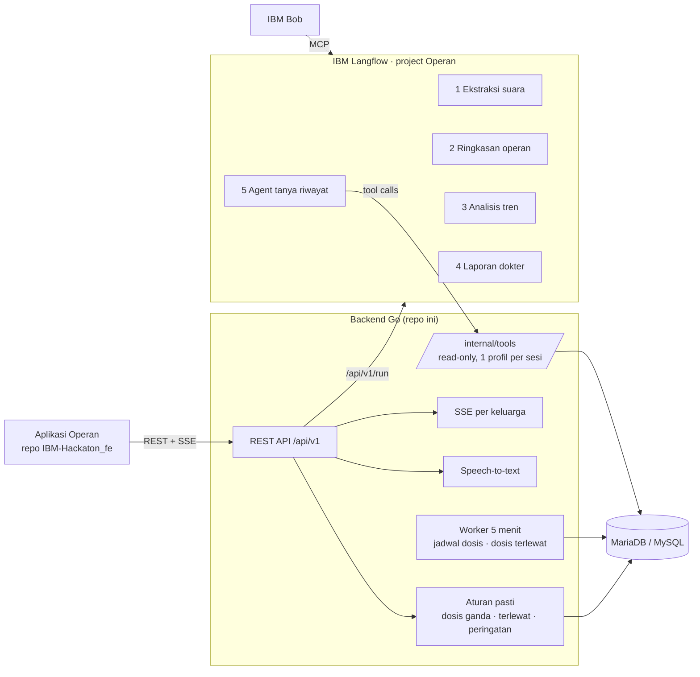

# Operan — Backend

|Dokumen MD ini hasil dari buatan AI untuk membantu summary dan visualisasi

Backend untuk **Operan**, aplikasi koordinasi perawatan keluarga (National Hackathon, tema Healthcare & Wellbeing).
Repo ini berisi REST API Go, skema database, aturan keamanan obat, integrasi IBM Langflow (5 flow AI),
dan speech-to-text. Aplikasi Android/Web ada di repo terpisah **`IBM-Hackaton_fe`**.

Prinsip utama: **keamanan obat tidak bergantung pada LLM.** Deteksi dosis ganda, dosis terlewat, dan peringatan
dasar adalah kode Go deterministik dengan unit test. AI hanya mencatat, merangkum, dan menandai, tanpa
mendiagnosis dan tanpa menentukan dosis.

## Teknologi

| Bagian | Teknologi |
|---|---|
| API | Go 1.22+, Gin, JWT (HS256), bcrypt |
| Database | MariaDB / MySQL (`go-sql-driver/mysql`), migrasi SQL tertanam di binary |
| Realtime | Server-Sent Events per keluarga |
| AI | IBM Langflow (5 flow), model Google Gemini |
| Speech-to-text | Gemini (Google AI Studio) atau endpoint OpenAI-compatible |


## Arsitektur



## Menjalankan lokal (Windows)

Kebutuhan: Go 1.22+ dan MariaDB/MySQL (XAMPP cukup). Langflow opsional: tanpa Langflow, backend memakai
mock deterministik sehingga semua endpoint tetap bisa dicoba tanpa API key.

```powershell
.\dev.ps1 db            # buat database operan + operan_test dan user operan/operan
copy .env.example .env  # lalu ganti JWT_SECRET dan INTERNAL_TOOL_TOKEN
.\dev.ps1 seed          # data demo (menghapus isi tabel)
.\dev.ps1 run           # API di http://localhost:8080, cek http://localhost:8080/healthz
```

Linux/macOS: target yang sama ada di `Makefile` (`make run`, `make seed`, `make test`).
Migrasi berjalan otomatis saat server start; `.\dev.ps1 migrate` untuk migrasi saja.

### Data demo

`.\dev.ps1 seed` mengisi "Keluarga Demo" dengan tanggal relatif terhadap hari ini:

- Akun: `ibu@demo.operan`, `ayah@demo.operan`, `nenek@demo.operan`, kata sandi `operan123` (atau `SEED_PASSWORD`).
- **Adik** (anak): demam 3 hari, paracetamol "bila perlu" dengan jarak minimal 4 jam, vitamin harian.
- **Kakek** (lansia): obat tensi 2x sehari, tensi naik 3 hari terakhir (memicu peringatan), satu dosis terlewat.

## Konfigurasi (`.env`)

| Variabel | Isi |
|---|---|
| `DATABASE_URL` | DSN MySQL, contoh `operan:operan@tcp(127.0.0.1:3306)/operan` |
| `JWT_SECRET` | rahasia token login (wajib diganti) |
| `APP_TIMEZONE` | default `Asia/Jakarta` |
| `CORS_ORIGINS` | origin aplikasi web, dipisah koma (`localhost:*` selalu diizinkan) |
| `LANGFLOW_MOCK` | `true` = tanpa Langflow; `false` = pakai flow asli |
| `LANGFLOW_URL`, `LANGFLOW_API_KEY`, `FLOW_ID_*` | dari Langflow, dicetak oleh `flows/build_flows.py` |
| `INTERNAL_TOOL_TOKEN` | header `X-Internal-Token` untuk tool agent Flow 5 |
| `PUBLIC_BASE_URL` | alamat backend yang dipanggil agent; pakai IP (`http://127.0.0.1:8080`), bukan `localhost` |
| `STT_MOCK`, `STT_PROVIDER`, `STT_API_KEY`, `STT_MODEL` | speech-to-text (default Gemini) |

## Langflow

Lima flow disimpan di project Langflow **Operan** dan dibuat otomatis lewat API:

```powershell
.\dev.ps1 langflow                 # jalankan Langflow (mengatur LANGFLOW_SSRF_ALLOWED_HOSTS)
python flows/build_flows.py        # buat/perbarui 5 flow, cetak baris FLOW_ID_* untuk .env
```

| Flow | Input | Output | Endpoint pemakai |
|---|---|---|---|
| 1 `extract_voice_log` | transkrip + daftar obat | catatan & dosis terstruktur | `POST /profiles/:id/voice` |
| 2 `handover_summary` | catatan & dosis satu giliran | ringkasan, belum dikerjakan, perlu diperhatikan | `GET /shifts/:id/handover-draft` |
| 3 `trend_analysis` | data 7 hari | daftar peringatan | otomatis setelah catatan baru, `POST /profiles/:id/analyze` |
| 4 `doctor_report` | data satu periode | ringkasan, pengamatan, pertanyaan untuk dokter | `POST /profiles/:id/reports` |
| 5 `ask_history` (Agent) | pertanyaan | jawaban + sumber | `POST /profiles/:id/ask` |

- Prompt dan contoh: `flows/prompts/`. Skema output: `flows/schemas/`. Export flow: `flows/*.json`.
- Panduan lengkap (model Gemini, agent + tool, MCP untuk Bob): `flows/README.md`.
- Guardrail yang sama ada di semua prompt, dan backend membuang output yang memuat kata terlarang
  (diagnosis, saran dosis).
- Ketahanan: output AI divalidasi terhadap skema; bila model gagal, lambat (> 25 detik), atau kena batas kuota,
  ekstraksi suara dan tanya-jawab memakai jawaban lokal dari data, sedangkan ringkasan dan laporan tetap terbuat
  tanpa bagian AI.

## API

Prefix `/api/v1`, JWT bearer. Error seragam: `{"error":{"code","message","details"}}`.

```
POST /auth/register  /auth/login     GET /auth/me        POST /devices
POST /families  /families/join       GET /families/:id  /families/:id/members  /families/:id/stream (SSE)
POST|GET /families/:id/profiles      GET|PATCH /profiles/:id
GET /profiles/:id/today              GET /profiles/:id/timeline?date=
POST|GET /profiles/:id/medications   PATCH /medications/:id     POST /medications/:id/give-prn
GET /profiles/:id/doses?date= | ?from=&to=
POST /doses/:id/give | /skip | /undo                             (409 DOUBLE_DOSE bila dosis ganda)
POST|GET /profiles/:id/logs          POST /profiles/:id/voice   POST /profiles/:id/voice/confirm
POST /profiles/:id/shifts/start      GET /shifts/:id/handover-draft   POST /shifts/:id/end
GET /profiles/:id/handovers/latest   PATCH /handovers/:id/read
GET /profiles/:id/alerts             PATCH /alerts/:id/read     POST /profiles/:id/analyze
POST /profiles/:id/reports           GET /reports/:id           GET /profiles/:id/reports/latest
POST /profiles/:id/ask
GET /internal/tools/profiles/:id/{logs|medications|doses}?session=   (khusus agent Flow 5)
```

SSE `GET /families/:id/stream` mengirim `dose_given`, `dose_undone`, `dose_skipped`, `log_created`,
`alert_created`, `alert_read`, `handover_created`, `handover_read`, `shift_changed`, `medication_changed`,
dan `profile_changed`, dengan heartbeat setiap 25 detik.

## Aturan keamanan obat

- **Dosis ganda**: pemberian ditahan (409 `DOUBLE_DOSE`) bila masih dalam jarak minimal yang diatur keluarga
  atau slot jadwal yang sama sudah diberikan. Respons memuat siapa, jam berapa, dan kapan boleh lagi.
  Bisa tetap dicatat dengan `force: true` + alasan, dan bisa dibatalkan 10 menit oleh pencatatnya.
- **Dosis terlewat**: worker setiap 5 menit menandai jadwal yang lewat lebih dari 30 menit.
- **Peringatan**: suhu ≥ 38° di 3 hari berturut-turut (anak), suhu ≥ 39,5°, tensi atas ≥ 160 tiga kali
  berturut-turut (lansia/kronis). Teks memakai bahasa awam dan selalu diakhiri saran konsultasi.

## Test

```powershell
.\dev.ps1 test
```

- `internal/service/rules_test.go` — dosis ganda (PRN dalam/luar jeda, batas tepat, jadwal slot sama/berbeda,
  pencatatan mundur), dosis terlewat, aturan demam 3 hari (3x di hari yang sama tidak memicu), suhu ≥ 39,5,
  tensi ≥ 160 tiga kali, teks peringatan tidak melanggar guardrail.
- `internal/langflow/parse_test.go` — parser output Langflow (code fence, teks tambahan, JSON rusak), skema, mock.
- `internal/handler/integration_test.go` — alur penuh di database nyata (`operan_test`): daftar → keluarga →
  join → 403 untuk bukan anggota → dosis ganda 409 → force → batalkan → suara → operan → laporan → tanya →
  batas sesi tool.
- `internal/sse/hub_test.go` — dua klien di keluarga yang sama menerima `dose_given`.

## Keamanan

- Setiap endpoint profil memeriksa keanggotaan keluarga (403 bila bukan anggota).
- Password bcrypt, JWT HS256. Database hanya mendengarkan di `127.0.0.1`.
- Log HTTP hanya mencatat method, route, status, dan durasi. Isi catatan kesehatan dan transkrip tidak dicatat.
- Rate limit endpoint AI (`/voice`, `/ask`, `/reports`, `/analyze`, draft operan).
- Tool agent: token statis + sesi acak 10 menit yang terikat satu `care_profile_id`.

## Bagaimana IBM Bob dipakai

1. **Review arsitektur (Architect Mode)**: skema database, kontrak REST API, dan aturan dosis ganda.
2. **Integrasi dengan Langflow lewat MCP**: Bob memanggil kelima flow dengan contoh dari `flows/prompts/`,
   membandingkan output dengan `flows/schemas/`, dan mengusulkan perbaikan prompt.
3. **Security review**: otorisasi per keluarga, endpoint tool agent, rate limit, dan log data kesehatan.

Bukti penggunaan (screenshot) dilampirkan di form submission.

## Struktur

```
cmd/server      main API                cmd/seed     data demo
internal/       config · db (query) · service (aturan + logika) · handler (HTTP)
                langflow (client, mock, parser) · stt · sse · middleware · apperr
migrations/     skema SQL (MariaDB/MySQL)
flows/          prompt, skema, script pembuat flow, dan export flow Langflow
```
